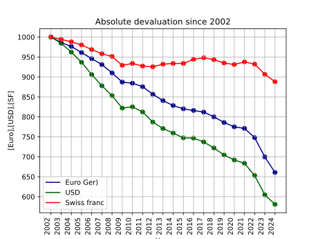

# Inflation

This small python script plots the devaluation of the \
Euro in germany, the US dollar and the swiss franc from 01.2002 - 01.2024.

## Plot 1
How to read this plot: \
1000€ in 2002 is equivalent in purchasing power to about ~ 1500€ today. \
If you´ve earned 1000€ in 2002, you would need to earn ~ 1500€ 2024 in order to "compensate" inflation.

## Plot 2
How to read this plot: \
1000€ saved in 2002 will only have a purchasing power of ~€650. Resulting in a purchasing power loss of 350€.

## Plot 3
How to read this plot: \
1000€ saved in 2002 (representing 100%) will only have a purchasing power of 65% of 2002.

References: 
[Inflation Data](https://www.inflation.eu/en/inflation-rates/switzerland/historic-inflation/cpi-inflation-switzerland-2023.aspx)

Improvements:
- Calculate with [CPI Data (Consumer Price Index)](https://www.officialdata.org/articles/consumer-price-index-since-1913/)
